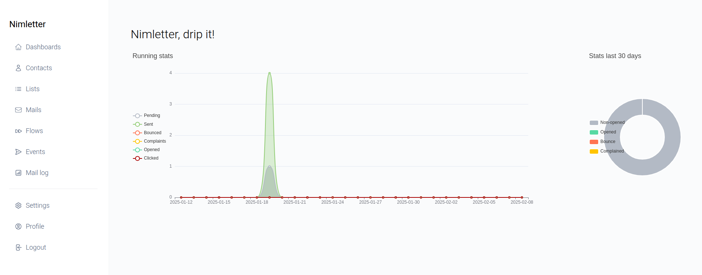
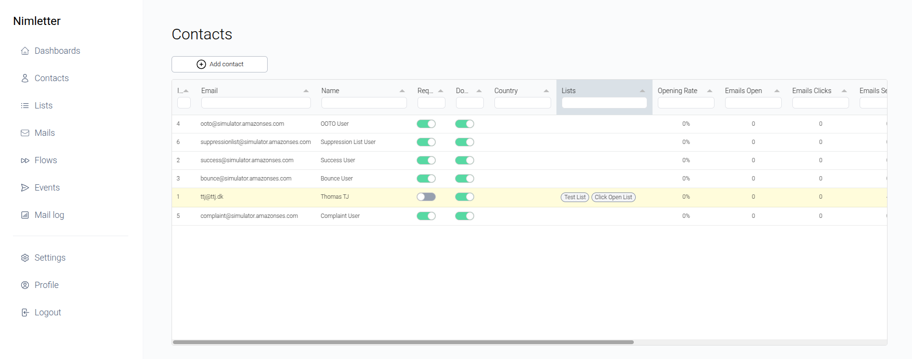
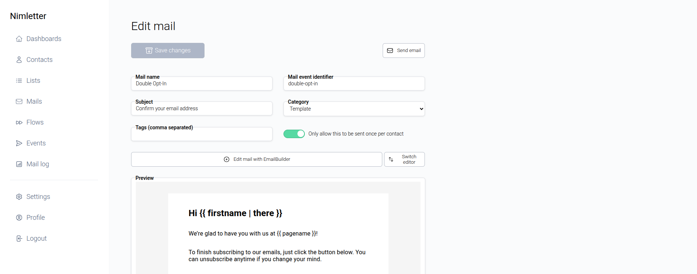
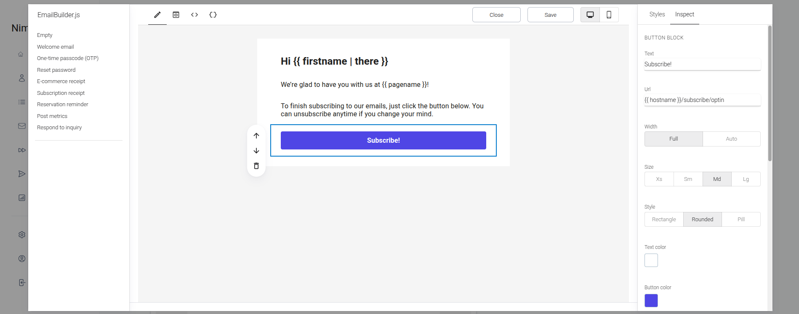
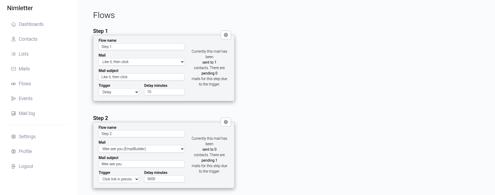
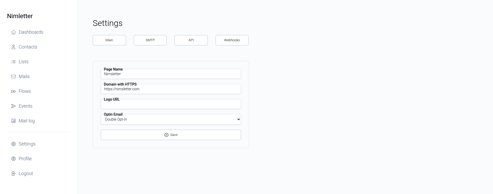
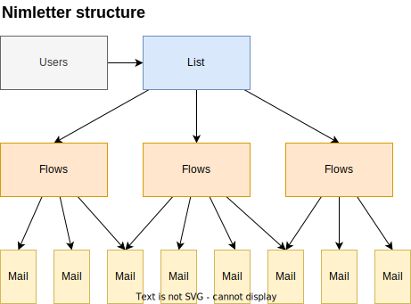
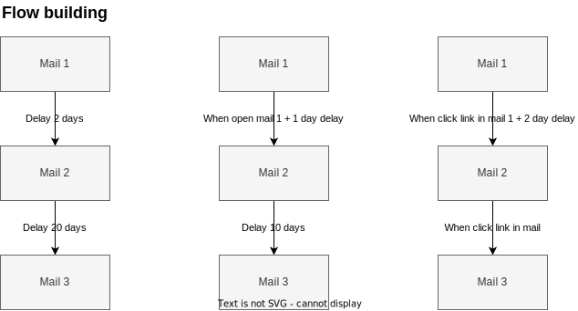
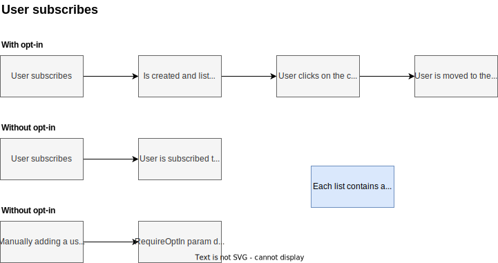

# 💌 Nimletter

**Self-hosted newsletter, drip, and transactional email system**.

Nimletter is built to replace the simple functionalities found in Mailchimp, Mailerlite, Sendgrid, and others. Let users subscribe and automatically start flows, or just send out your weekly newsletter.


## ✨ Features

- 🚀 **BYO SMTP server**
- 📊 **Open and click tracking integrated without setup**
- 📊 **Bounce, complaint tracking with AWS or other callback**
- 🖱️ **Drag and Drop email builder**
- 📝 **Variables / Attributes in mails**
- 📆 **Drip campaigns**
- 📧 **Transactional emails**
- ✅ **Subscribe and double opt-in**
- 🔗 **Webhook for Zapier, etc.**
- 🔌 **API with simple endpoints**
- 🔐 **Yubikey OTP security**
- 🎨 **Customizable templates**
- ⚙️ **Customizable settings**

## Flow Concepts

### Adding Users to a Flow
You can add a user to an ongoing flow, and the user will start at step one. This is useful for adding new users to a drip campaign. By using the API, you can also add the user to a specific step in the flow.

### Extending Flows
If a flow with 10 steps is completed and you add an additional step (11), the flow will continue for the users already in the flow. For a generic newsletter or tips & tricks flow, you can keep adding new steps, and users will continue to receive the new content.

### Managing Flows with Mail-Callbacks
Using the mail-callback, flows can be managed based on user actions. If a user clicks a link in the email, you can add the user to a new flow or step in the flow, or even when the user opens the email. This is useful for creating a more engaging flow.

## Dashboard



## Contacts



## Mail preview



## Mail builder



## Flows / Drips



## Settings



**Reason for development**:

I needed a simple system to design and send out my newsletter, but also sending drip campaigns with tips and tricks when new users signed up. Besides those two core features, I also needed to keep track of bounces and complaints to maintain my domain reputation.

That was doable with the big players, but I wanted to have full control over the system and the user data (GDPR and syncing to my SaaS). So I ended up with something like Mailerlite for campaigns and Google templates for newsletters.


## ✨ Building Emails

Unleash your creativity with the drag-and-drop email builder, powered by EmailbuilderJS! Create templates and personalize your emails effortlessly. Nimletter supports a variety of variables to make each email unique and engaging.

### Available Variables
You can use the following variables in your emails:
- `{{ firstname }}`
- `{{ lastname }}`
- `{{ name }}`
- `{{ email }}`
- `{{ pagename }}`
- `{{ hostname }}`
- `{{ uuid }}`
- `{{ unsubscribe_href }}`
- `{{ unsubscribe_link }}`

Each variable supports default values, so you can write `{{ firstname | "there" }}` to ensure a friendly fallback.

### User-Specific Attributes
Enhance personalization by using user-specific attributes. For example, if you collect the user's country during opt-in, you can use `{{ country }}` in your emails. Add any additional attributes to the user, and they become available for use in your email content.

## 🗂️ Structure of Lists, Flows, and Emails

Visualize the structure of your lists, flows, and emails with our intuitive diagram:



## 🔄 Flows

Create dynamic email flows with customizable delays, clicks, and opens. Mix and match to design the perfect engagement strategy!



## 📬 Subscribe

Easily manage subscriptions with unique links for each list. Embed these links on your website or in your emails to grow your audience. Users will be added to the list and start the flow if one is set. Combine multiple lists by separating their UUIDs with commas.



## Events

### Send immediate mail
```sh
curl -X POST \
  -H "Content-Type: application/json" \
  -H "Authorization: Bearer YOUR_API_KEY" \
  -d '{
        "event": "email-send",
        "email": "nim@nimletter.com",
        "mail": "welcome-mail",
        "delay": 0
      }' \
  http://localhost:5555/api/event
```

### Send mail after 40 minutes
```sh
curl -X POST \
  -H "Content-Type: application/json" \
  -H "Authorization: Bearer YOUR_API_KEY" \
  -d '{
        "event": "email-send",
        "email": "nim@nimletter.com",
        "mail": "first-login",
        "delay": 40
  }' \
  http://localhost:5555/api/event
```

### Send mail with custom content and subject
```sh
curl -X POST \
  -H "Content-Type: application/json" \
  -H "Authorization: Bearer YOUR_API_KEY" \
  -d '{
        "event": "email-send",
        "email": "nim@nimletter.com",
        "content": "<div>Custom content</div>",
        "subject": "Custom subject",
        "delay": 40
  }' \
  http://localhost:5555/api/event
```

### Cancel mail
```sh
curl -X POST \
  -H "Content-Type: application/json" \
  -H "Authorization: Bearer YOUR_API_KEY" \
  -d '{
        "event": "email-cancel",
        "email": "nim@nimletter.com",
        "mail": "welcome-mail"
      }' \
  http://localhost:5555/api/event
```

### Create contact
```sh
curl -X POST \
  -H "Content-Type: application/json" \
  -H "Authorization: Bearer YOUR_API_KEY" \
  -d '{
    "event": "contact-create",
    "email": "mail@nimletter.com",
    "name": "Nim Letter",
    "double_opt_in": false,
    "flow_step": 1
  }' \
  http://localhost:5555/api/event
```

### Create contact and add to list
```sh
curl -X POST \
  -H "Content-Type: application/json" \
  -H "Authorization: Bearer YOUR_API_KEY" \
  -d '{
      "event": "contact-create",
      "email": "mail@nimletter.com",
      "name": "Nim Letter",
      "double_opt_in": false,
      "flow_step": 1,
      "list": "list-identifier"
    }' \
  http://localhost:5555/api/event
```

### Create contact and add to list with optin email
```sh
curl -X POST \
  -H "Content-Type: application/json" \
  -H "Authorization: Bearer YOUR_API_KEY" \
  -d '{
      "event": "contact-create",
      "email": "mail@nimletter.com",
      "name": "Nim Letter",
      "double_opt_in": true,
      "flow_step": 1,
      "list": "list-identifier"
    }' \
  http://localhost:5555/api/event
```

### Transfer contact from other system
```sh
curl -X POST \
  -H "Content-Type: application/json" \
  -H "Authorization: Bearer YOUR_API_KEY" \
  -d '{
      "event": "contact-create",
      "email": "mail@nimletter.com",
      "name": "Nim Letter",
      "double_opt_in": false,
      "flow_step": 3,
      "list": "list-identifier,list-identifier2"
    }' \
  http://localhost:5555/api/event
```

### Update (replace) contact (contactID OR email required)
```sh
curl -X POST \
  -H "Content-Type: application/json" \
  -H "Authorization: Bearer YOUR_API_KEY" \
  -d '{
      "event": "contact-update",
      "email": "nim@nimletter.com",
      "name": "Nim Letter",
      "status": "enabled",
      "double_opt_in": false,
      "opted_in": false,
      "meta": "{\"country\":\"Denmark\",\"language\":\"DK\"}"
    }' \
  http://localhost:5555/api/event
```

### Update meta-tags
```sh
curl -X POST \
  -H "Content-Type: application/json" \
  -H "Authorization: Bearer YOUR_API_KEY" \
  -d '{
      "event": "contact-meta",
      "email": "nim@nimletter.com",
      "meta": "{\"country\":\"Denmark\",\"nim\":\"lang\"}"
    }' \
  http://localhost:5555/api/event
```

### Contact exists
```sh
curl -X POST \
  -H "Content-Type: application/json" \
  -H "Authorization: Bearer YOUR_API_KEY" \
  -d '{
      "event": "contact-exists",
      "email": "mail@nimletter.com"
    }' \
  http://localhost:5555/api/event
```


# 🚀 Startup

## Start the database
Create the database for starters (this for an new postgresql instance, otherwise use another username and password):
```sh
psql -U postgres -c "CREATE USER postgres WITH PASSWORD 'postgres';"
psql -U postgres -c "CREATE DATABASE nimletter_db OWNER postgres;"
psql -U postgres -c "GRANT ALL PRIVILEGES ON DATABASE nimletter_db TO postgres;"
```

### Option A) Docker / Podman compose
```sh
docker compose -f nimletter-compose.yaml up --detach
# or
podman compose -f nimletter-compose.yaml up --detach
```

### Option B) Run the container
__(Only database setup is needed)__
```sh
podman run \
  --name nimletter \
  --network host \
  --rm \
  -e PG_HOST=localhost:5432 \
  -e PG_USER=postgres \
  -e PG_PASSWORD=postgres \
  -e PG_DATABASE=nimletter_db \
  -e PG_WORKERS=3 \
  -e SMTP_HOST=smtp_host \
  -e SMTP_PORT=465 \
  -e SMTP_USER=smtp_username \
  -e SMTP_PASSWORD=smtp_password \
  -e SMTP_FROMEMAIL=admin@nimletter.com \
  -e SMTP_FROMNAME=ADMIN \
  -e SMTP_MAILSPERSECOND=1 \
  -e SNS_WEBHOOK_SECRET=secret \
  ghcr.io/thomastjdev/nimletter:latest
```

### Option C) Compile and run
__(See environment setup below for configuration)__
```sh
git clone
cd nimletter
nim c -d:release nimletter
# First run creates the database and inserts test data
./nimletter --DEV_RESET
./nimletter
```

### Option D) Systemd service file
```sh
cp postgres.service ~/.config/systemd/user/
# (the same as below)
cp nimletter.service ~/.config/systemd/user/
podman pull ghcr.io/thomastjdev/nimletter:latest
systemctl --user daemon-reload
systemctl --user start nimletter
systemctl --user status nimletter
systemctl --user enable nimletter
```

## Default credentials

The admin credentials default to:
```sh
email: admin@nimletter.com
password: dripit
```

You can override these by using environment variables:
```sh
-e ADMIN_EMAIL=admin@nimletter.com
-e ADMIN_PASSWORD=dripit
```

And within the system, you can customize the username and password. The password is hashed using salt and bcrypt, and you can even enable Yubikey OTP.

# 📧 SMTP

Nimletter is optimized for AWS SES but can be used with any SMTP server. The core part for managing bounces, complaints, and deliveries is done by the webhook endpoint. The formats can be seen in the `tests` folder.

If you are using AWS, just set up an SMTP Configuration, add relevant events, attach to an SNS topic, and point the webhook to the Nimletter endpoint.

__(The SNS_WEBHOOK_SECRET can also be set inside the settings page)__
```sh
/webhook/incoming/sns/" & getEnv("SNS_WEBHOOK_SECRET", "secret")
```

If the `SMTP_HOST` is specified as an environment variable, then it won't use the saved values in the database.

# 🌐 Environment variables
The values are customizable within the system and will be saved to the database.

**Database**
```sh
export PG_HOST=localhost
export PG_USER=postgres
export PG_PASSWORD=postgres
export PG_DATABASE=nimletter_db
export PG_WORKERS=3
```

**SMTP**
```sh
export SMTP_HOST=smtp_host
export SMTP_PORT=465
export SMTP_USER=smtp_username
export SMTP_PASSWORD=smtp_password
export SMTP_FROMEMAIL=admin@nimletter.com
export SMTP_FROMNAME=
export SMTP_MAILSPERSECOND=1
```

**SNS SECRET**
```sh
export SNS_WEBHOOK_SECRET=secret
```

**GEO**
__(Only relevant for binary, included in image)__
```sh
export GEOIP_PATH=/usr/share/GeoIP/GeoIP.dat
```

**Subscription**
The `ALLOW_GLOBAL_SUBSCRIPTION` is a global setting that allows users to subscribe at `/subscribe` without a specific list. The user will be added to the default list in this case. Default is `false`.
```sh
export ALLOW_GLOBAL_SUBSCRIPTION=true
```

# 🛠️ How to setup a postgres database manually
```sql
-- Step 1: Connect to PostgreSQL as a superuser
\c postgres;

-- Step 2: Create the user
CREATE USER postgres WITH PASSWORD 'postgres';

-- Step 3: Create the database
CREATE DATABASE nimletter_db OWNER postgres;

-- Step 4: Grant privileges to the user on the database
GRANT ALL PRIVILEGES ON DATABASE nimletter_db TO postgres;
```

or

```sh
psql -U postgres -c "CREATE USER postgres WITH PASSWORD 'postgres';"
psql -U postgres -c "CREATE DATABASE nimletter_db OWNER postgres;"
psql -U postgres -c "GRANT ALL PRIVILEGES ON DATABASE nimletter_db TO postgres;"
```

# 📚 Icons

https://heroicons.com/

# 📦 Libraries

* EmailbuilderJS by usewaypoint
* Tabulator by olifolkerd

# 🔜 Next

* Backend
  * Valkey (Redis) as caching for all DB values
  * ~~Backup schedule checking (`checkAndSendScheduledEmails(backupCheck = true)`)~~
  * ~~Move mail sending to another dedicated sender thread with synchronous channel (queue)~~
  * SQLite support
  * Moving JS to TypeScript
  * API testing with Bruno
* User stuff
  * Captcha for subscribe
  * User managed pages for "subscribe" and "unsubscribe" and "optin"
* Frontend
  * Better overview of user and their interactions
  * Which links the user clicked on
  * Better overview in flows of open and click rates and users
