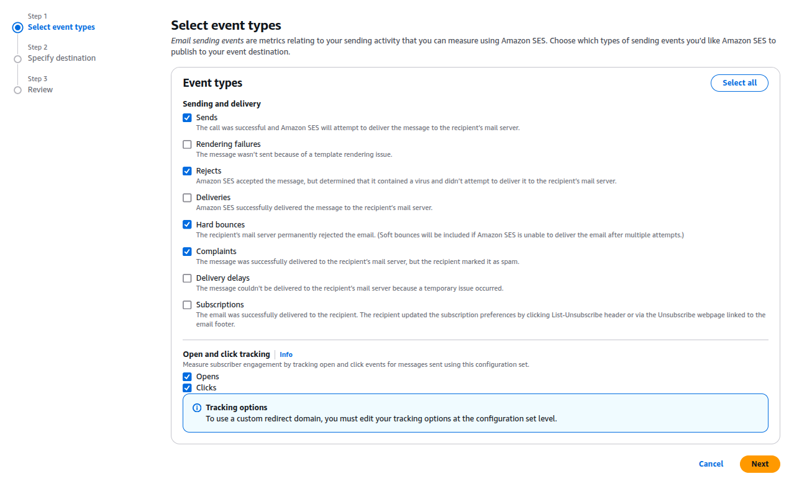
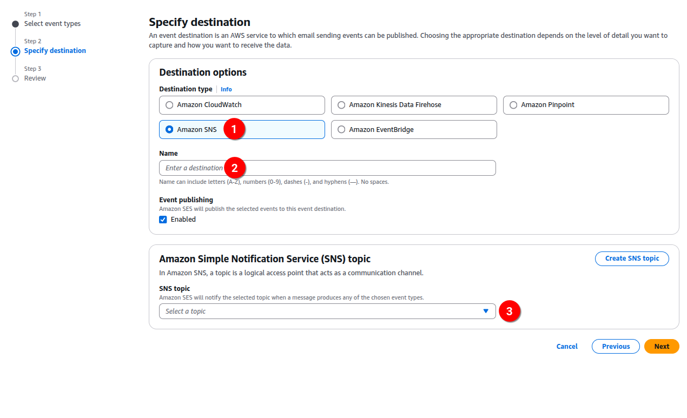

# Configuration sets

Create a configuration set which will be used on your verified domain/sender in AWS SES.

Do not use track of "open" and "click" events, as this is managed by the
nimletter itself.

# SNS Topic

Input the domain `/webhook/incoming/sns/secret` to confirm the subscription (http or https).